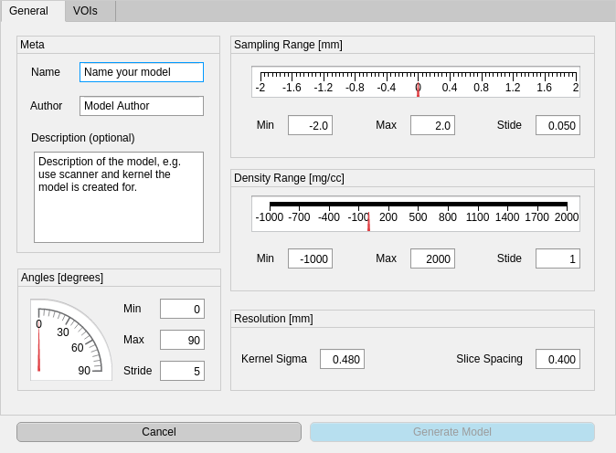
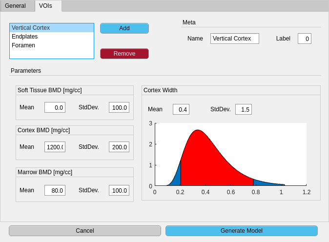
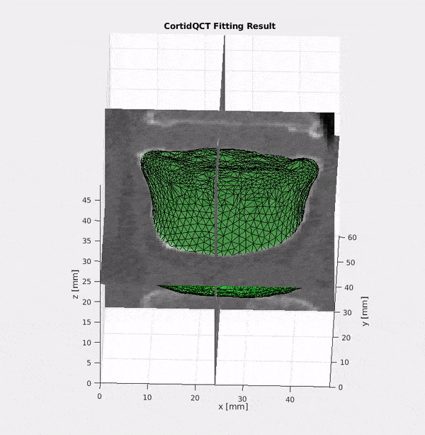
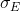
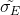

# Corid-QCT [](https://travis-ci.com/ithron/CortidQCT) [](https://ci.appveyor.com/project/ithron/cortidqct/branch/master)

A tool for automatic cortical shape identification for QCT scans.

This software is based on
"**An Analysis by Synthesis Approach for Automatic Vertebral Shape Identification in Clinical QCT**" by
*[Stefan Reinhold](https://orcid.org/0000-0003-3117-1569), [Timo Damm](https://orcid.org/0000-0002-5595-5205), Lukas Huber, [Reimer Andresen](https://orcid.org/0000-0002-1575-525X), Reinhard Barkmann, [Claus-C. Glüer](https://orcid.org/0000-0003-3539-8955) and [Reinhard Koch](https://orcid.org/0000-0003-4398-1569)*, accepted for publication in Springer LNCS, presented on "German Conference on Pattern Recognition 2018". [arXiv](https://arxiv.org/abs/1812.00693)

## Binary Releases

The current release is **v1.2.2**:

- [CortidQCT-v1.2.2-win64.zip](https://github.com/ithron/CortidQCT/releases/download/v1.2.2/CortidQCT-v1.2.2-win64.zip) Windows x64 binary release
- [CortidQCT-v1.2.2-macOS-Mojave.zip](https://github.com/ithron/CortidQCT/releases/download/v1.2.2/CortidQCT-v1.2.2-macOS-Mojave.zip) macOS Mojave binary release
- [CortidQCT-v1.2.2-x86_64-linux-gnu-ubuntu-18.04.tar.gz](https://github.com/ithron/CortidQCT/releases/download/v1.2.2/CortidQCT-v1.2.2-x86_64-linux-gnu-ubuntu-18.04.tar.gz) Ubuntu Linux 18.04 x86_64 binary release
- [CortidQCT-v1.2.2.mltbx](https://github.com/ithron/CortidQCT/releases/download/v1.2.2/CortidQCT-v1.2.2.mltbx) MATLAB toolbox

Older releases can be found [here](https://github.com/ithron/CortidQCT/releases).

## Build from Source
The build instructions below are for *NIX (Unix/Linux/macOS) systems only.
For Windows build, the configuration steps (1 to 4) should be the same, but the compilation step might be different, dependent on the compiler used.

### C++ Library

#### Requirements
- *cmake* version 3.9 or newer
- A modern C++ compiler with C++17 support is required. These compilers are known to work:
  - gcc: version 7.3 or later
  - clang:
    - version 4.0 or later (with libc++ or stdlibc++-7.3 or later)
    - on Windows: version 7.0 with Visual Studio 2017 or later
  - AppleClang: version 10.0 or later (Xcode 10, since macOS 10.4 Mojave)
  - ~~MSVC++: version 14.1 or later (Visual Studio 2017 version 15.0 or later)~~
    <span style='color:red'>Due to a compiler bug MSVC 14.1 does currently not work</span>

#### Building

*CortidQCT* uses the [Hunter](https://hunter.sh) package manager to manage its dependencies.
Therefore, it's not required to manually install any dependecies.
Hunter builds and installs all dependencies automatically in the ```${HOME}/.hunter``` directory.
This can be changed by setting the `HUNTER_ROOT` environment variable.

It is strongly recommended to install CortidQCT to a custom location. For this, set the `CortidQCT_ROOT` environment to the desired path.


1. Clone the repository:
   ```bash
   git clone htts://github.com/ithron/CortidQCT.git
   ```
2. Init the submodules:
   ```bash
   cd CortidQCT
   git submodule update --init
   ```
3. Create build directory
   ```bash
   mkdir Build
   cd build
   ```
4. Run `cmake`
  ```bash
  cmake -DCMAKE_INSTALL_PREFIX=${CortidQCT_ROOT} -DCMAKE_BUILD_TYPE=Release ../
  ```
5. Run
  ```bash
  make
  ```
6. installation
  ```bash
  make install
  ```

### MATLAB Toolbox

#### Requirements
- MATLAB R2017b or later
- Parallel Computing Toolbox
- Statistics Toolbox
- A CUDA compatible GPU
- CUDA drivers

#### Installation

Navigate to the installation folder in MATLAB, then
open `matlab/CortidQCT.prj`. This opens
the toolbox packaging dialog. Click 'Package' and close the dialog.
Double click the new file `CortidQCT.mltbx` to install the toolbox.

## Usage
Using *CortidQCT* is a two step process. First a model for each different protocol must be generated using the MATLAB toolbox.
After that, either the *command line interface (CLI)* tool, the *C+++ library* or the MATLAB interface can be used to identify the cortex using the generated model.

## Model Creation

 | 
:---------------------------------------------------------------:|:----------------------------------------------------------------:
General model parameters dialog | Per VOI parameters dialog

In MATLAB run
```matlab
CortidQCT.CreateModel
```
to start the model creation UI.
On the first screen (general tab, see left screenshot above) meta and general information about the model can be entered.
In the VOIs tab (see right screenshot above), per VOI prior parameters can be entered.
Ensure that each VOI gets an unique label.
Since the interpretation of the parameters of log-normally distributed cortex width parameter is not very  intuituve, a plot of the current PDF is plotted in the bottom right.
The red shaded region shows the 95% confidence interval.

After specifying all VOIs, click the *Generate Model* button start start the generation process.
Depending on the hardware, this process may take a while.
When the model generation completed, a green *Save Model* button will appear.
Ensure to save the model before quitting the dialog.

## Cortex Identification
You can either write your own program that uses the *C++ library*, use the built-in CLI tool or use the MATLAB interface that comes with the toolbox.

### Command Line interface
After compilation the `CortidQCT_CLI` executable can be found in `build/app`.
It requires at least three parameters:
 1. A YAML configuration file
 2. The input volume / scan
 3. Path to the output mesh file
 4. _Optional: Path to a file where to write the per-vertex labels to_

```bash
app/CortidQCT_CLI <configurationFile> <inputVolume> <outputMesh> [outputLabels]
```

### C++ Library
The [API Reference](https://ithron.github.io/CortidQCT/html/index.html) can be found [here](https://ithron.github.io/CortidQCT/html/index.html).

### C Bindings
Available since Version v1.1.0.
See the `C-Bindings` module in the [API Reference](https://ithron.github.io/CortidQCT/html/index.html) for details. An example can be found in `bindings/C/examples/cli.c`.

### Matlab Interface

Since version 1.2.0 CortidQCT also has MATLAB bindings, enabling the direct interaction with the library from within MATLAB.

An example implementation of the CLI interface can be found in `examples/CortidQCT_cli.m`:
```matlab
function [resultMesh, volume] = CortidQCT_cli(configFilename, volumeFilename, outputMeshFilename, varargin)
%CORTIDQCT-CLI Identifies the cortical shape of the given volume and writes
%the output to the given file

import CortidQCT.lib.*;

% Load volume
volume = VoxelVolume.fromFile(volumeFilename);

% Create MeshFitter using config file
fitter = MeshFitter(configFilename);

% fit
result = fitter.fit(volume);

% write output
result.mesh.writeToFile(outputMeshFilename, varargin{:});

% plot results
volume.plot;
hold on;
h = result.mesh.plot;
axis equal
colormap gray

h.FaceColor = 'g';
h.FaceAlpha = 0.3;

resultMesh = result.mesh;

end
```
This function mimics the CLI application with additional visualization of the result:
<p align="center"></p>

### Configuration File
The main purpose of the configuration file is to specify the reference mesh and the model file.
Additionally some parameters can be customized.
The configuration file must be in the [YAML](http://yaml.org/start.html) format.

#### Reference mesh
The following snippet defines a refernece mesh `path/to/reference/mesh.coff` consisting of a colored `object file format` mesh.
Here each vertex color corresponds to a model label.
The mapping is defined in the `colorToLabelMap` section.
The custom mapping is supplied in the `map` section.
Each element must be a two element list that contains a three element list and a single ineteger label:
`[[R, G, B], Label]`.

The ```origin: centerd``` parameter states that the centroid of the reference mesh should be moved into the center of the image, which is the default behaviour.
```YAML
referenceMesh:
  mesh: path/to/refernce/mesh.coff
  colorToLabelMap:
    type: custom
    map:
      - [[255, 0, 0], 1]¬
      - [[0, 255, 0], 0]¬
      - [[255, 255, 0], 2]¬
      - [[0, 0, 255], 3]¬
    undefinedLabel: 4
  origin: centered
```
If a relative path is given, it is interpreted as relative to the configuration file.

#### Measurement Model
The measurement model is specified by the path to the previously generated model file:
```YAML
measurementModel: path/to/my/model.yml
```
If a relative path is given, it is interpreted as relative to the configuration file.

#### Optimization Parameters
There are several optional parameters that can be tuned:
```YAML
sigmaE: 5.4
sigmaS: 2
maxIterations: 100
minNonDecreasing: 3
decay: 0.1
```

- `sigmaE`: Scale parameter of the ARAP shape prior energy term (defaults to 5.4). Note that due to a slightly different implementation, the parameter is not exactly like in the paper. If  is original parameter from the paper, then  is the equivalent parameter for this implementation. So to reproduce the  = 2 from the paper, you have to set  = 5.4.
- `sigmaS`: Displacement prior scale parameter, defaults to 2 (see paper).
- `maxIterations`: Maximum number of iterations, defaults to 100.
- `minNonDecreasing`: Minimum number of iterations before entering decay mode, defaults to 10
- `decay`: Decay factor used in decay mode, defaults to 0.9.

##### Decay Mode
Since an approximate alternating optimization scheme is used, it might happen, that the optimizer oscillates between two solutions and never completely converges. To circumvent this oscillation, the mean absolute displacement is monitored.
Everytime it doesn't decrease for at least `minNonDecreasing` iterations, the current `sigmaS` is multiplied by `decay`, resulting in a decay of step size over time, enforcing convergence.

## Performance
This implementation is, opposed to the original prototype underlying the publication, highly optimized.
While the original prototype required a few minutes for about 50 iterations, this implementation can make 50 iterations in about 20 seconds (on an Intel(R) Core(TM) i7-8700K CPU @ 3.70GHz).

The optimization time does of course depends on the size of the model and the scans.
